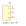

# All the parts

// TODO: this should be automated / template driven

## LCSC_C385834: RJ45-TH_R-RJ45R08P-A004

## LCSC_C7429634: CONN-TH_4P-P2.50_4PIN

## LCSC_C1509680: JL301-50004U01

## LCSC_C8483: WJ301V-5.0-3P

