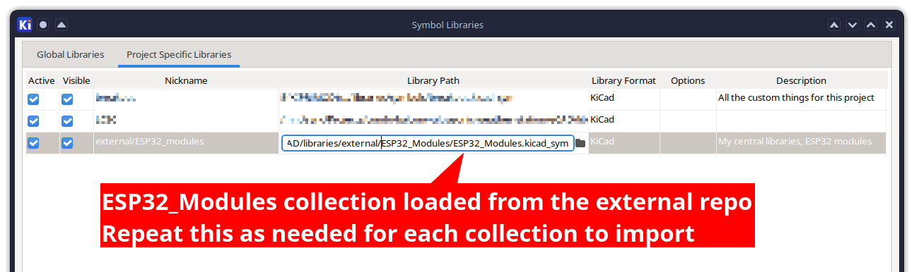

<!-- markdownlint-disable-file MD045 -->
# Misc/Assorted collection of KiCad libraries

This repo contains a mix of KiCad libraries that I've created or modified.

I got tired of copy/pasting the same footprints over and over again so I decided to put them in a repo with the intent of using this repo as a sub-module in other project repos since KiCad doesn't have good support for sharing footprints between projects with version control.

> **Warning**
> There is _absolutely_ zero guarantee that these footprints are correct. I've done my best to make sure they are correct but I'm not perfect. If you find a mistake, please open an issue or submit a pull request.
>
> **USE AT YOUR OWN RISK**

## Using with KiCad

Tl;DR: `git submodule add -- X relativePathHere`

Let's say you have a project repo structured like this:

```shell
.
├── readme.md
├── components/
│   └── someSensor/
│       └── datasheet.pdf
├── mCad/
│   ├── pcb-outline.dxf
│   ├── enclosure.step
│   └── enclosure.3mf
└── eCad/
    ├── exports/
    │   └── prod.gerber.zip
    ├── projectName/
    │   ├── projectName.kicad_sch
    │   └── projectName.kicad_pcb
    └── libraries/
        ├── projectName
        └── external
```
<!-- Source:
https://tree.nathanfriend.io/?s=(%27options!(%27fancy6~fullPath!false~trailingSlash6~rootDot6)~8(%278%27readme.md5components*someSensor0datasheet.pdf5mApcb-outline.dxf4step43mf5eAexports0prod.gerber.zip*27sch7pcb0*libraries020external*%27)~version!%271%27)*590*92projectName4*enclosure.5%5Cn6!true702.kicad_8source!9%20%20ACad*%01A98765420*
-->

And you wanted to add this repo as a sub-module in `eCad/libraries/external` directory:

```shell
❯ git submodule add -- https://github.com/kquinsland/kicad-libraries eCAD/libraries/external
Cloning into '.../eCAD/libraries/external'...
remote: Enumerating objects: 21, done.
remote: Counting objects: 100% (21/21), done.
remote: Compressing objects: 100% (17/17), done.
remote: Total 21 (delta 3), reused 21 (delta 3), pack-reused 0
Receiving objects: 100% (21/21), 216.10 KiB | 64.00 KiB/s, done.
Resolving deltas: 100% (3/3), done.
❯ git status
On branch main
Changes to be committed:
  (use "git restore --staged <file>..." to unstage)
        new file:   .gitmodules
        new file:   eCAD/libraries/external
```

Commit the `.gitmodules` to the project repo and then add the `$projectRoot/eCad/libraries/external/$specificLibrary` directory to the KiCad library/footprint tables.



The reason for doing the git submodule + "project specific" path instead of the "Global Libraries" is I can version control the sub module.

KiCad - as far as I know - does NOT support version control for global libraries.

## TODO

Would be nice to GHA CI/CD to automatically generate images of the footprints and add them to the readme.

```shell
uv tool install kikit
```
